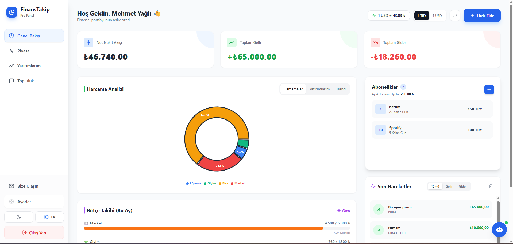
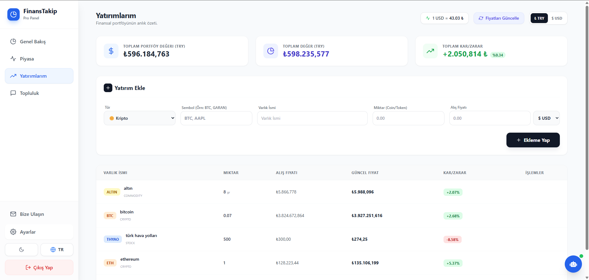
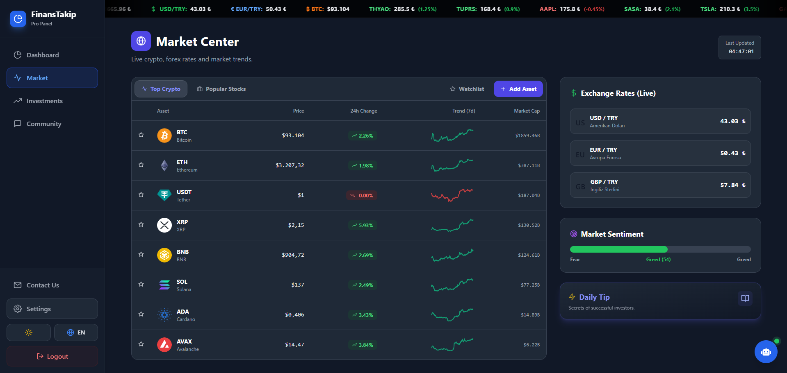
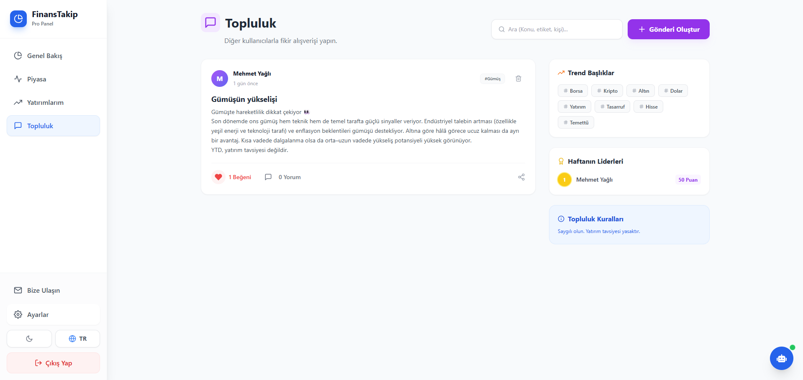
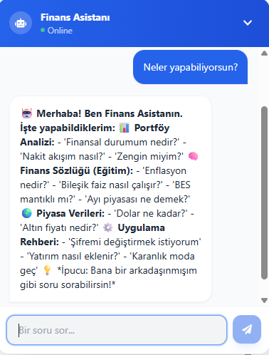

# 🚀 FinansPro - Akıllı Portföy & Finans Yönetim Sistemi

> **Modern web teknolojileri kullanılarak geliştirilmiş, yapay zeka destekli kapsamlı bir finansal takip platformu.**

🔗 **Canlı Demo (Live):** [https://finans-app-frontend.onrender.com](https://finans-app-frontend.onrender.com)

---

## 🚧 Geliştirme Durumu (Work in Progress - v1.0 Beta)

⚠️ **Bu proje şu anda aktif geliştirme aşamasındadır.**

Uygulamanın temel fonksiyonları (Gelir/Gider takibi, Dashboard, Auth işlemleri, Kripto verileri) sorunsuz çalışmaktadır. Ancak proje canlı bir süreçte olduğu için aşağıdaki çalışmalarım devam etmektedir:

* 🔄 **Optimizasyon:** Veri yükleme hızlarını artırmak için backend tarafında cache (önbellek) mekanizmaları geliştiriliyor.
* 🐛 **Hata Giderimi:** Bazı grafiklerin mobildeki responsive görünümü ve API limitlerine bağlı veri gecikmeleri üzerinde çalışılıyor.
* ✨ **Yeni Özellikler:** Kullanıcı geri bildirimlerine göre yeni yatırım araçları eklenmeye devam ediliyor.

*(Demo sürümünde API limitleri nedeniyle veriler bazen geç yüklenebilir.)*

---

## 📸 Projeden Kareler

### 🔹 Ana Kontrol Paneli (Dashboard)
Kullanıcının finansal özetini, varlık dağılımını ve harcama analizlerini gördüğü merkezi ekran.

### 🔹 Yatırım Portföyü & Varlık Yönetimi
Kripto para, altın, döviz ve borsa yatırımlarının anlık kâr/zarar takibi.

### 🔹 Piyasa Merkezi (Dark Mode)
Canlı kripto para ve borsa verilerinin anlık takibi.

### 🔹 Topluluk & Sosyal Etkileşim
Kullanıcıların finansal konularda fikir alışverişi yapabildiği forum alanı.

### 🔹 AI Finans Asistanı
Portföy durumuna göre kişiselleştirilmiş finansal tavsiyeler veren yapay zeka entegrasyonu.

---

## 🌟 Temel Özellikler

### 📊 Finansal Analiz
* **Gelir/Gider Takibi:** Harcamaların kategorilere (Market, Fatura, Kira vb.) göre detaylı grafikleri.
* **Net Varlık Hesabı:** Tüm nakit ve yatırımların toplam değerinin anlık hesaplanması.

### 💰 Varlık Yönetimi
* **Çoklu Varlık Desteği:** Kripto, Borsa (BIST/NASDAQ), Altın ve Döviz takibi.
* **Canlı Veri:** Entegre API'ler ile anlık fiyat güncellemeleri.
* **Kâr/Zarar Analizi:** Yatırımın maliyeti ve güncel değeri arasındaki farkın renkli analizi.

### 🤖 Teknoloji & İnovasyon
* **Yapay Zeka (AI) Asistanı:** Portföy durumuna göre "Yatırımlarını çeşitlendirmelisin" gibi akıllı öneriler sunan chatbot.
* **Abonelik Yöneticisi:** Netflix, Spotify gibi düzenli ödemeleri takip edip hatırlatan modül.
* **Tema Desteği:** Kullanıcı dostu Dark/Light mod seçeneği.

---

## 🛠️ Teknik Altyapı (Tech Stack)

Bu proje **MERN Stack** mimarisi ile "Clean Code" prensiplerine sadık kalınarak geliştirilmiştir.

| Alan | Teknolojiler |
| :--- | :--- |
| **Frontend** | React.js (Vite), Tailwind CSS, Recharts, Axios, Context API |
| **Backend** | Node.js, Express.js, JWT (Auth), RESTful API Mimari |
| **Database** | MongoDB (Atlas), Mongoose ODM |
| **DevOps** | Render (Deployment), Git/GitHub (Versiyon Kontrol) |

---

## 🗺️ Yol Haritası (Roadmap)

Gelecek versiyonlar için planlanan geliştirmeler:

- [ ] 📱 **Mobil Uygulama:** React Native ile iOS ve Android sürümü.
- [ ] 🔔 **Bildirim Sistemi:** Bütçe aşımı veya ani fiyat düşüşlerinde e-posta uyarısı.
- [ ] 🏦 **Banka Entegrasyonu:** Open Banking API ile banka hareketlerinin otomatik çekilmesi.
- [ ] 🌍 **Çoklu Dil Desteği:** İngilizce/Türkçe dil seçeneğinin tam entegrasyonu.

---

## 👨‍💻 İletişim & Geliştirici

Bu proje **Mehmet Yağlı** tarafından geliştirilmektedir. Kod incelemesi, öneri veya iletişim için:

* 📧 **E-Posta:** yagli.my@gmail.com
* 💼 **LinkedIn:** [Mehmet Yağlı](https://www.linkedin.com/in/mehmet-ya%C4%9Fl%C4%B1-64485826b/)

---
*Not: Bu repo, projenin kaynak kodlarını içermeyen bir vitrin (Showcase) deposudur. Proje özel sunucularda (Private Repo) barındırılmaktadır.*
